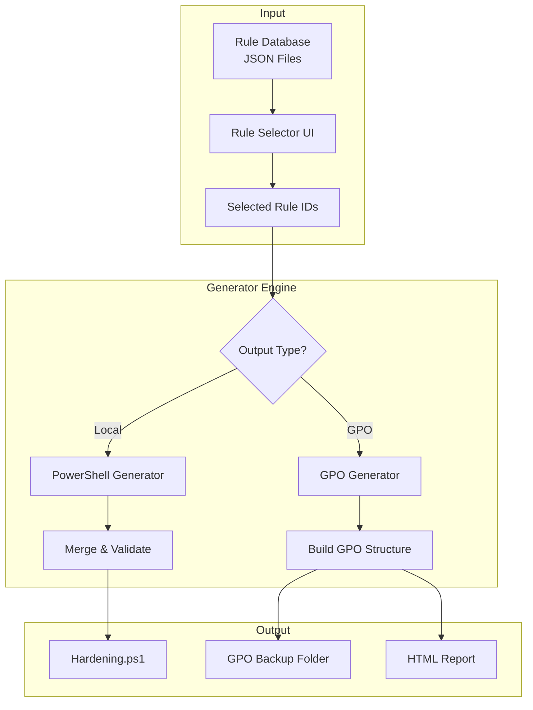
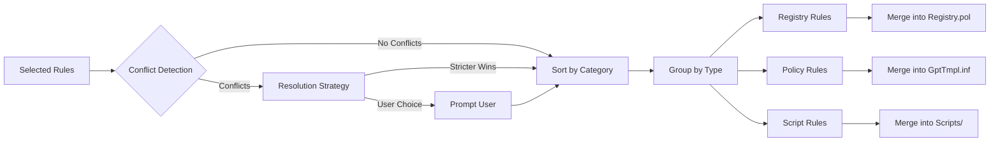

# Windows Hardening Orchestrator Architecture Design

This document defines the architectural design for a modular Windows Hardening Tool based on CIS Benchmarks, supporting both local PowerShell execution and enterprise GPO deployment.

---

## 1. Standardized Rule Schema (JSON)

Each hardening rule will be represented as a JSON object. This schema serves as the backbone for both the PowerShell executor and GPO generator.

```json
{
  "$schema": "http://json-schema.org/draft-07/schema#",
  "type": "object",
  "properties": {
    "rule_id": {
      "type": "string",
      "description": "CIS Benchmark reference number (e.g., '1.1.1')"
    },
    "title": {
      "type": "string",
      "description": "Short rule name"
    },
    "description": {
      "type": "string",
      "description": "Detailed description and impact analysis"
    },
    "cis_level": {
      "type": "integer",
      "enum": [1, 2],
      "description": "CIS Level classification (1 = basic, 2 = advanced)"
    },
    "category": {
      "type": "string",
      "description": "Rule category (e.g., 'Account Policies', 'Audit Policy')"
    },
    "applies_to": {
      "type": "array",
      "items": { "type": "string" },
      "description": "Windows editions (e.g., ['Windows 11', 'Windows Server 2022'])"
    },
    "registry_config": {
      "type": "object",
      "properties": {
        "path": { "type": "string", "description": "Full registry path" },
        "value_name": { "type": "string", "description": "Registry value name" },
        "value_type": {
          "type": "string",
          "enum": ["REG_DWORD", "REG_SZ", "REG_EXPAND_SZ", "REG_MULTI_SZ", "REG_QWORD"],
          "description": "Registry value type"
        },
        "value_data": {
          "type": ["string", "integer", "array"],
          "description": "Expected value data"
        },
        "comparison": {
          "type": "string",
          "enum": ["equals", "less_than_or_equal", "greater_than_or_equal", "not_equals", "exists", "not_exists"],
          "default": "equals"
        }
      },
      "required": ["path", "value_name", "value_type", "value_data"]
    },
    "gpo_config": {
      "type": "object",
      "properties": {
        "policy_path": { "type": "string", "description": "GPO policy path" },
        "setting_name": { "type": "string" },
        "setting_value": { "type": ["string", "integer", "boolean"] },
        "admx_category": { "type": "string", "description": "ADMX template category" }
      }
    },
    "implementation_local": {
      "type": "object",
      "properties": {
        "powershell_command": { "type": "string", "description": "Single-line PS command" },
        "powershell_script": { "type": "string", "description": "Multi-line PS script block" },
        "requires_admin": { "type": "boolean", "default": true },
        "requires_reboot": { "type": "boolean", "default": false }
      }
    },
    "implementation_gpo": {
      "type": "object",
      "properties": {
        "inf_section": { "type": "string", "description": "Security template INF section" },
        "inf_key": { "type": "string" },
        "inf_value": { "type": "string" },
        "gpo_xml": { "type": "string", "description": "Raw GPO XML fragment for registry.pol" }
      }
    },
    "audit_logic": {
      "type": "object",
      "properties": {
        "powershell_script": {
          "type": "string",
          "description": "PowerShell script block returning $true/$false"
        },
        "expected_result": { "type": "boolean", "default": true }
      },
      "required": ["powershell_script"]
    },
    "remediation_rollback": {
      "type": "object",
      "description": "(DEFERRED) Future capability to restore settings",
      "properties": {
        "powershell_command": { "type": "string", "description": "Command to revert" },
        "original_value": {
          "type": ["string", "integer", "null"],
          "description": "Default Windows value or null to delete"
        }
      }
    },
    "references": {
      "type": "array",
      "items": { "type": "string" },
      "description": "URLs to CIS docs, Microsoft KB articles"
    },
    "tags": {
      "type": "array",
      "items": { "type": "string" },
      "description": "Searchable tags"
    }
  },
  "required": ["rule_id", "title", "description", "cis_level", "audit_logic"]
}
```

---

## 2. Example Rule Definition

```json
{
  "rule_id": "1.1.1",
  "title": "Ensure 'Enforce password history' is set to '24 or more passwords'",
  "description": "This policy setting determines the number of renewed, unique passwords that must be associated with a user account before an old password can be reused. Password reuse is a significant concern in any organization.",
  "cis_level": 1,
  "category": "Account Policies",
  "applies_to": ["Windows 11", "Windows 10", "Windows Server 2022", "Windows Server 2019"],

  "registry_config": {
    "path": "HKLM:\\SYSTEM\\CurrentControlSet\\Services\\Netlogon\\Parameters",
    "value_name": "PasswordHistorySize",
    "value_type": "REG_DWORD",
    "value_data": 24,
    "comparison": "greater_than_or_equal"
  },

  "gpo_config": {
    "policy_path": "Computer Configuration\\Policies\\Windows Settings\\Security Settings\\Account Policies\\Password Policy",
    "setting_name": "Enforce password history",
    "setting_value": 24,
    "admx_category": "PasswordPolicy"
  },

  "implementation_local": {
    "powershell_command": "net accounts /uniquepw:24",
    "powershell_script": "Set-ItemProperty -Path 'HKLM:\\SYSTEM\\CurrentControlSet\\Services\\Netlogon\\Parameters' -Name 'PasswordHistorySize' -Value 24 -Type DWord -Force",
    "requires_admin": true,
    "requires_reboot": false
  },

  "implementation_gpo": {
    "inf_section": "[System Access]",
    "inf_key": "PasswordHistorySize",
    "inf_value": "24",
    "gpo_xml": "<RegistryValue name='PasswordHistorySize' type='REG_DWORD' value='24'/>"
  },

  "audit_logic": {
    "powershell_script": "$val = (Get-ItemProperty -Path 'HKLM:\\SYSTEM\\CurrentControlSet\\Services\\Netlogon\\Parameters' -Name 'PasswordHistorySize' -ErrorAction SilentlyContinue).PasswordHistorySize; return ($val -ge 24)",
    "expected_result": true
  },

  "remediation_rollback": {
    "powershell_command": "net accounts /uniquepw:0",
    "original_value": 0
  },

  "references": [
    "https://www.cisecurity.org/benchmark/microsoft_windows_desktop",
    "https://docs.microsoft.com/en-us/windows/security/threat-protection/security-policy-settings/enforce-password-history"
  ],

  "tags": ["password", "account-policy", "authentication", "level-1"]
}
```

---

## 3. Generator Logic Architecture

The generator engine processes selected rules and produces deployment-ready outputs.

### 3.1 Architecture Overview



### 3.2 PowerShell Script Generator

The generator merges multiple rules into a cohesive `.ps1` script:

```powershell
# Generated Script Structure
#==============================================================================
# CIS Windows Hardening Script
# Generated: {timestamp}
# Rules: {count} selected
# Level: {cis_level_filter}
#==============================================================================

#region Configuration
$Script:ReportPath = "$env:USERPROFILE\CIS_Report_$(Get-Date -Format 'yyyyMMdd_HHmmss')"
$Script:Results = @()
$Script:BackupData = @{}
#endregion

#region Audit Functions
function Test-CIS_1_1_1 {
    <#
    .SYNOPSIS
        {title}
    .DESCRIPTION
        {description}
    #>
    try {
        {audit_logic.powershell_script}
    } catch {
        return $false
    }
}
# ... more audit functions
#endregion

#region Remediation Functions
function Set-CIS_1_1_1 {
    [CmdletBinding(SupportsShouldProcess)]
    param([switch]$Force)

    # Backup current value
    $Script:BackupData['1.1.1'] = Get-ItemProperty -Path '{registry_path}' -Name '{value_name}' -EA SilentlyContinue

    # Apply remediation
    {implementation_local.powershell_script}
}
# ... more remediation functions
#endregion

#region Rollback Functions
# (DEFERRED)
#endregion

#region Main Execution
function Invoke-CISHardening {
    param(
        [switch]$AuditOnly,
        [switch]$Remediate,
        [switch]$GenerateReport
    )

    $rules = @(
        @{ Id = '1.1.1'; Title = '{title}'; AuditFunc = 'Test-CIS_1_1_1'; RemediateFunc = 'Set-CIS_1_1_1' }
        # ... all selected rules
    )

    foreach ($rule in $rules) {
        $result = [PSCustomObject]@{
            RuleId = $rule.Id
            Title = $rule.Title
            BeforeStatus = 'Unknown'
            AfterStatus = 'Unknown'
            Action = 'None'
            Details = ''
        }

        # Phase 1: Audit BEFORE
        $result.BeforeStatus = if (& $rule.AuditFunc) { 'Pass' } else { 'Fail' }

        # Phase 2: Remediate if needed
        if ($Remediate -and $result.BeforeStatus -eq 'Fail') {
            try {
                & $rule.RemediateFunc
                $result.Action = 'Remediated'
            } catch {
                $result.Action = 'Failed'
                $result.Details = $_.Exception.Message
            }
        }

        # Phase 3: Audit AFTER
        if ($result.Action -eq 'Remediated') {
            $result.AfterStatus = if (& $rule.AuditFunc) { 'Pass' } else { 'Fail' }
        }

        $Script:Results += $result
    }

    if ($GenerateReport) {
        Export-CISReport
    }
}
#endregion
```

### 3.3 GPO Generator

The GPO generator creates a complete GPO backup structure:

```
GPO_Backup/
├── {GUID}/
│   ├── Backup.xml              # GPO metadata
│   ├── bkupInfo.xml            # Backup information
│   ├── gpreport.xml            # GPO report
│   └── DomainSysvol/
│       └── GPO/
│           ├── Machine/
│           │   ├── Registry.pol        # Registry policies
│           │   ├── Scripts/
│           │   │   ├── Startup/
│           │   │   └── Shutdown/
│           │   └── microsoft/
│           │       └── windows nt/
│           │           └── SecEdit/
│           │               └── GptTmpl.inf  # Security template
│           └── User/
│               └── Registry.pol
├── manifest.xml
└── CIS_Hardening_Report.html
```

#### GptTmpl.inf Generation (Security Template)

```ini
[Unicode]
Unicode=yes

[System Access]
; CIS 1.1.1 - Password History
PasswordHistorySize = 24
; CIS 1.1.2 - Maximum Password Age
MaximumPasswordAge = 365

[Registry Values]
; CIS 2.3.1.1 - Network Access
MACHINE\System\CurrentControlSet\Control\Lsa\LimitBlankPasswordUse=4,1

[Privilege Rights]
; CIS 2.2.1 - Access Credential Manager
SeTrustedCredManAccessPrivilege =

[Version]
signature="$CHICAGO$"
Revision=1
```

#### Registry.pol Generation

```powershell
# Registry.pol binary format writer
function New-RegistryPol {
    param([array]$Entries)

    $stream = [System.IO.MemoryStream]::new()
    $writer = [System.IO.BinaryWriter]::new($stream)

    # Header: PReg signature + version
    $writer.Write([byte[]]@(0x50, 0x52, 0x65, 0x67))  # "PReg"
    $writer.Write([int32]1)  # Version

    foreach ($entry in $Entries) {
        # [key;valuename;type;size;data]
        $writer.Write([char]'[')
        # ... write entry data
        $writer.Write([char]']')
    }

    return $stream.ToArray()
}
```

### 3.4 Rule Merging Strategy



**Conflict Resolution Rules:**
1. **Same Registry Key**: Stricter value wins (smaller for minimums, larger for maximums)
2. **Contradictory Settings**: Warn user, require explicit choice
3. **Dependencies**: Auto-include dependent rules (e.g., password complexity requires min length)

---

## 4. Audit Report Structure

### 4.1 Report Data Model

```json
{
  "report_metadata": {
    "generated_at": "2026-01-11T20:48:26+03:00",
    "hostname": "WORKSTATION-01",
    "os_version": "Windows 11 Pro 23H2",
    "domain": "CONTOSO.LOCAL",
    "executed_by": "CONTOSO\\admin",
    "total_rules": 45,
    "execution_mode": "remediate"
  },
  "summary": {
    "passed_before": 12,
    "failed_before": 33,
    "passed_after": 40,
    "failed_after": 5,
    "not_applicable": 2,
    "errors": 3,
    "compliance_before": 26.7,
    "compliance_after": 88.9
  },
  "rules": [
    {
      "rule_id": "1.1.1",
      "title": "Enforce password history",
      "cis_level": 1,
      "category": "Account Policies",
      "status_before": "Fail",
      "status_after": "Pass",
      "action_taken": "Remediated",
      "expected_value": "≥24",
      "actual_value_before": "0",
      "actual_value_after": "24",
      "remediation_time_ms": 150,
      "error_message": null
    }
  ],
  "failed_rules": [
    {
      "rule_id": "2.3.1.1",
      "title": "Network access: Allow anonymous SID/Name translation",
      "failure_reason": "Registry key is protected by system policy",
      "recommended_action": "Apply via Group Policy instead",
      "error_details": "Access denied to HKLM:\\..."
    }
  ]
}
```

### 4.2 HTML Report Template

```html
<!DOCTYPE html>
<html>
<head>
  <title>CIS Benchmark Compliance Report</title>
  <style>
    :root {
      --pass: #00c853;
      --fail: #ff1744;
      --warn: #ff9100;
      --na: #9e9e9e;
    }
    /* Modern dark theme styling */
  </style>
</head>
<body>
  <header>
    <h1>CIS Windows Hardening Report</h1>
    <div class="meta">
      <span>Host: {hostname}</span>
      <span>Generated: {timestamp}</span>
    </div>
  </header>

  <section class="dashboard">
    <div class="score-card">
      <div class="score">{compliance_after}%</div>
      <div class="label">Compliance Score</div>
    </div>
    <div class="stats-grid">
      <div class="stat pass">{passed_after} Passed</div>
      <div class="stat fail">{failed_after} Failed</div>
      <div class="stat fixed">{remediated_count} Fixed</div>
    </div>
  </section>

  <section class="failed-rules">
    <h2>⚠️ Failed Rules - Action Required</h2>
    <table>
      <tr>
        <th>Rule ID</th>
        <th>Title</th>
        <th>Expected</th>
        <th>Actual</th>
        <th>Reason</th>
        <th>Recommendation</th>
      </tr>
      <!-- Dynamic rows -->
    </table>
  </section>

  <section class="all-rules">
    <h2>📋 Complete Rule Results</h2>
    <!-- Filterable/sortable table -->
  </section>
</body>
</html>
```

### 4.3 Console Output Format

```
╔══════════════════════════════════════════════════════════════════════════════╗
║                    CIS WINDOWS HARDENING - AUDIT REPORT                       ║
╠══════════════════════════════════════════════════════════════════════════════╣
║ Host: WORKSTATION-01          │ Time: 2026-01-11 20:48:26                    ║
║ OS: Windows 11 Pro 23H2       │ Rules Checked: 45                            ║
╚══════════════════════════════════════════════════════════════════════════════╝

COMPLIANCE SUMMARY
┌─────────────────────────────────────────────────────────────────┐
│ Before Remediation: ████████░░░░░░░░░░░░░░░░░░░░░░░░ 26.7%      │
│ After Remediation:  ████████████████████████████░░░░ 88.9%      │
└─────────────────────────────────────────────────────────────────┘

FAILED RULES (5)
┌────────┬───────────────────────────────────────┬──────────────────────────────┐
│ ID     │ Title                                 │ Failure Reason               │
├────────┼───────────────────────────────────────┼──────────────────────────────┤
│ 2.3.1  │ Network access: Anonymous SID        │ Access denied - use GPO      │
│ 18.9.1 │ Windows Defender SmartScreen         │ Policy override required     │
└────────┴───────────────────────────────────────┴──────────────────────────────┘

📄 Full report saved to: C:\Users\admin\CIS_Report_20260111_204826\report.html
```

---

## 5. Proposed Directory Structure

```
platforms/windows/
├── schema/
│   └── rule-schema.json           # JSON Schema definition
├── rules/
│   ├── index.json                 # Rule registry
│   ├── S1_Account_Policies/
│   │   ├── 1.1.1.json
│   │   ├── 1.1.2.json
│   │   └── ...
│   ├── S2_Local_Policies/
│   └── ...
├── tools/
│   ├── generator.ps1              # Main generator script
│   ├── gpo_builder.ps1            # GPO backup creator
│   ├── audit_engine.ps1           # Audit execution engine
│   └── report_generator.ps1       # HTML/JSON report generator
├── templates/
│   ├── script_template.ps1        # PowerShell script template
│   ├── gpo_template/              # GPO folder structure template
│   └── report_template.html       # HTML report template
└── output/                        # Generated artifacts
```

---

## 6. Verification Plan

### Automated Tests
Since this is an architectural design document, there are no automated tests to run. However, when implementation begins:

1. **Schema Validation Test**: Run JSON Schema validation on all rule files
   ```powershell
   # Example test command (when tests are implemented)
   Invoke-Pester -Path .\tests\Schema.Tests.ps1
   ```

2. **Generator Unit Tests**: Test script generation with known inputs

### Manual Verification
1. **User Review**: Validate schema design meets requirements
2. **Prototype Testing**: Create 3-5 sample rules and test generation
3. **GPO Import Test**: Import generated GPO into test domain environment

---

## 7. User Review Required

> [!IMPORTANT]
> **Design Decision: Schema Format**
> I've proposed JSON for the rule schema due to its excellent PowerShell integration via `ConvertFrom-Json`. However, YAML could be used for better human readability. Please confirm your preference.

> [!IMPORTANT]
> **Design Decision: GPO Generation**
> The GPO generator will create a complete backup structure that can be imported via `Import-GPO`. This requires the GroupPolicy module and domain admin rights. Alternatively, we could generate only the security template (`.inf` file) which is simpler but less comprehensive.

**Questions for Review:**
1. Should we support both JSON and YAML for rule definitions?
2. For GPO output, should we target `Import-GPO` compatibility or simpler `.inf` templates?
3. Should the rollback feature create automatic backups before any remediation?
4. Are there specific CIS sections you want implemented first (e.g., Account Policies)?
