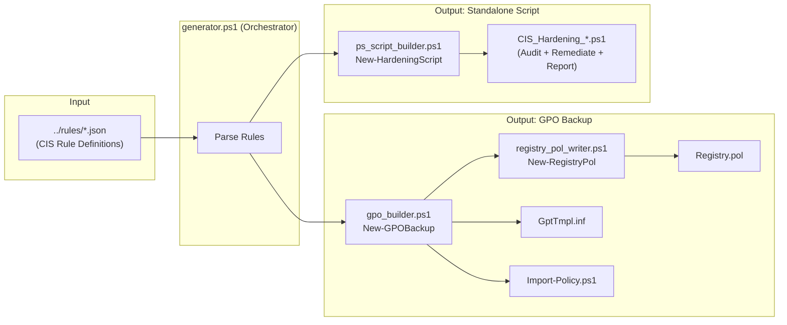

# CIS Windows Hardening — Generator Toolkit

> **Backend engine** for the CIS Hardening Generator web application.
> Reads JSON rule definitions and produces two deployment formats:
> **GPO Backups** (Active Directory) and **Standalone Scripts** (local/workgroup PCs).

---

## Directory Overview

This toolkit provides a **unified generation pipeline** that translates CIS Benchmark rule definitions (JSON) into ready-to-deploy security artifacts. A single invocation of `generator.ps1` produces:

| Output | Target Environment | Deployment Method |
|--------|--------------------|-------------------|
| **GPO Backup Folder** | Active Directory domains | `Import-GPO` or GPMC GUI |
| **Standalone PS1 Script** | Workgroup / isolated PCs | Run directly as Administrator |

```
../rules/*.json ──► generator.ps1 ──┬──► GPO_Backup_<timestamp>/
                                     │     ├── Import-Policy.ps1
                                     │     ├── manifest.xml
                                     │     ├── README.md
                                     │     └── {BackupGUID}/
                                     │          ├── Backup.xml
                                     │          ├── bkupInfo.xml
                                     │          ├── gpreport.xml
                                     │          └── DomainSysvol/...
                                     │
                                     └──► CIS_Hardening_<timestamp>.ps1
```

---

## File Reference

### `generator.ps1` — Orchestrator (Entry Point)

The CLI entry point that wires everything together. It:

1. Discovers all `*.json` rule files under `../rules/` recursively
2. Parses each rule into a standardized `[PSCustomObject]` array
3. Dot-sources the builder modules below
4. Calls `New-HardeningScript` → produces the standalone `.ps1`
5. Calls `New-GPOBackup` → produces the GPO backup folder

**Usage:**
```powershell
cd platforms\windows\tools
.\generator.ps1
```

All output goes to `../output/` with a timestamp suffix. The script currently generates **both** formats unconditionally (no `-Mode` switch).

---

### `gpo_builder.ps1` — GPO Backup Builder

Creates a complete, portable GPO backup folder structure compatible with `Import-GPO`.

**Key function:** `New-GPOBackup`

| Parameter | Default | Description |
|-----------|---------|-------------|
| `-Rules` | *(required)* | Processed rule objects from generator |
| `-OutputPath` | *(required)* | Root directory for the backup |
| `-GPOName` | `"CIS Windows Hardening"` | Display name for the imported GPO |
| `-GPODescription` | *(auto)* | Description text embedded in the GPO |

**Portability features:**
- **Generic domain placeholders** — All XML metadata uses `HARDENING_TEMPLATE` and `DC.HARDENING_TEMPLATE.LOCAL` instead of real domain names. `Import-GPO` ignores source domain metadata during import, so these placeholders don't affect functionality.
- **No path leaks** — `bkp:SourceExpandedPath` uses the GPO variable `%GPO_MACH_FSPATH%` instead of the build server's local filesystem path.
- **Fresh GUIDs** — `[guid]::NewGuid()` is called for both `$gpoGuid` and `$backupGuid` on every invocation, preventing GUID conflicts across multiple downloads.
- **Import-Policy.ps1** — A helper script is auto-generated alongside the backup. End-users can run it directly on their Domain Controller to import the GPO with zero configuration.

**Also provides:** `New-SecurityTemplateContent` — Generates the `GptTmpl.inf` security template content from rules that have `implementation_gpo.inf_section` fields.

---

### `ps_script_builder.ps1` — Standalone Script Builder

Generates a self-contained PowerShell script that can be run directly on any Windows machine to audit and remediate security settings **without Active Directory**.

**Key function:** `New-HardeningScript`

| Parameter | Default | Description |
|-----------|---------|-------------|
| `-Rules` | *(required)* | Processed rule objects |
| `-OutputPath` | *(required)* | Path for the output `.ps1` file |
| `-AuditOnly` | `$false` | If set, omits remediation functions |

**How it works:**

For each rule, the builder generates:
- `Test-CIS_<rule_id>()` — Audit function using the rule's `audit_logic.powershell_script`
- `Set-CIS_<rule_id>()` — Remediation function using `implementation_local.powershell_script` or `powershell_command`

These are wired into an `Invoke-CISHardening` orchestrator with a built-in rule registry (embedded JSON). The generated script supports three execution modes:

```powershell
# Audit only — check compliance without changing anything
.\CIS_Hardening_<timestamp>.ps1 -AuditOnly

# Audit + Remediate — fix non-compliant settings
.\CIS_Hardening_<timestamp>.ps1 -Remediate

# Audit + Remediate + Generate HTML Report
.\CIS_Hardening_<timestamp>.ps1 -Remediate -GenerateReport
```

The generated script includes an embedded `Export-CISReport` function that produces a dark-themed HTML dashboard with pass/fail/remediated statistics.

---

### `inf_generator.ps1` — Security Template (INF) Generator

Generates standalone `.inf` security template files that can be applied via `secedit.exe` on individual machines.

**Key function:** `New-SecurityTemplate`

- Reads `implementation_gpo.inf_section/inf_key/inf_value` from rules
- Also converts `registry_config` entries to INF `[Registry Values]` format
- Generates an `_apply.ps1` companion script that runs `secedit /configure`
- Outputs in **Unicode encoding** as required by `secedit.exe`

> **Note:** This is separate from `gpo_builder.ps1`'s `New-SecurityTemplateContent`, which generates the INF content *within* a GPO backup structure. This file generates a **standalone** INF + apply script.

---

### `registry_pol_writer.ps1` — Registry.pol Binary Writer

Generates `Registry.pol` files in the correct binary format (PReg) for GPO machine policy.

**Key function:** `New-RegistryPol`

- Writes the `PReg` header (`0x50526567` + version `1`)
- Encodes registry entries as `[key;valueName;type;size;data]` binary records
- Supports `REG_SZ`, `REG_EXPAND_SZ`, `REG_BINARY`, `REG_DWORD`, `REG_MULTI_SZ`, `REG_QWORD`
- Called by `gpo_builder.ps1` for rules that have `registry_config` fields

---

### `report_generator.ps1` — HTML/JSON Report Generator

Generates static HTML and JSON reports summarizing which CIS rules are included in a generation run.

**Key function:** `New-HardeningReport`

> **Note:** Static report generation is currently **disabled** in `generator.ps1`. Reports are now generated at runtime by the embedded `Export-CISReport` function inside the standalone script.

---

### `consistency_report.md` — Documentation

Internal consistency analysis document for the rule definitions.

---

### `Verify-Tools.ps1` — Automated Test Suite

End-to-end verification script that validates the entire generation pipeline. Runs **66 tests** across 5 categories:

| Category | What It Tests |
|----------|---------------|
| Pre-flight | Source files and rule JSONs exist |
| Execution | Generator runs twice without errors |
| GPO Output | Structure, portability (`HARDENING_TEMPLATE`), security (no path leaks), GUID uniqueness |
| Standalone Script | PowerShell syntax, expected functions (`Test-CIS_*`, `Set-CIS_*`), parameters, commands |
| Cross-Validation | Same rules appear in both GPO and standalone outputs |

```powershell
cd platforms\windows\tools
.\Verify-Tools.ps1
```

Exits with `0` on success or the failure count for CI/CD integration.

---

## Architecture Diagram



---

## Rule JSON Schema (Input)

Each `.json` file in `../rules/` must contain the following fields used by the generators:

```jsonc
{
  "rule_id": "1.1.1",
  "title": "Ensure 'Enforce password history' is set to '24 or more'",
  "cis_level": 1,
  "category": "Account Policies",

  // Used by ps_script_builder.ps1
  "audit_logic": {
    "powershell_script": "...",
    "expected_result": true
  },

  // Used by ps_script_builder.ps1
  "implementation_local": {
    "powershell_script": "...",
    "requires_admin": true,
    "requires_reboot": false
  },

  // Used by gpo_builder.ps1 → GptTmpl.inf
  "implementation_gpo": {
    "inf_section": "[System Access]",
    "inf_key": "PasswordHistorySize",
    "inf_value": "24"
  },

  // Used by registry_pol_writer.ps1 → Registry.pol
  "registry_config": {
    "path": "HKLM:\\SOFTWARE\\...",
    "value_name": "...",
    "value_type": "REG_DWORD",
    "value_data": 1
  }
}
```

---

## Quick Start

### Generate everything locally
```powershell
cd platforms\windows\tools
.\generator.ps1
```

### Import GPO into Active Directory
```powershell
cd ..\output\GPO_Backup_<timestamp>
.\Import-Policy.ps1
```

### Run standalone hardening script
```powershell
# Audit only
.\CIS_Hardening_<timestamp>.ps1 -AuditOnly

# Audit + remediate + report
.\CIS_Hardening_<timestamp>.ps1 -Remediate -GenerateReport
```

### Run automated tests
```powershell
cd platforms\windows\tools
.\Verify-Tools.ps1
# Exits 0 = all pass, >0 = failure count
```

---

## Security & Portability Notes

| Feature | Details |
|---------|---------|
| **No server data leaked** | GPO XMLs use `HARDENING_TEMPLATE` placeholder, `SourceExpandedPath` uses `%GPO_MACH_FSPATH%` variable |
| **Fresh GUIDs per request** | Every `New-GPOBackup` call generates new `GPOGuid` + `BackupGuid` via `[guid]::NewGuid()` |
| **Universal import** | `Import-GPO` ignores source domain metadata — backups work on any AD domain |
| **GPO not auto-linked** | Imported GPO must be manually linked to target OUs after review |
| **Admin required** | Standalone scripts enforce `#Requires -RunAsAdministrator` |
